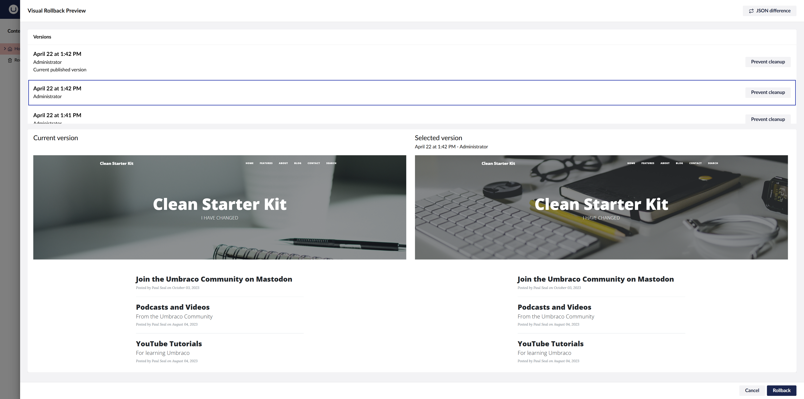

# Compare Versions & Rollback — Options and Design

| Field | Value |
| --- | --- |
| Audience | Product, architects, developers |
| Platform | Umbraco 17 LTS / .NET 10 |
| Demo | Block Diff POC (`BlockDiffDemo`) |
| Related | Built-in Info → History / Rollback, Rollback Previewer, Compare versions workspace view |
| Status | POC implemented on branch `cursor/block-diff-theme-and-filters` |

---

## 1. Purpose

Editors need to:

1. See **what changed** between two versions of a page (especially Block List / Block Grid / Rich Text), not raw JSON.
2. **Preview** an older version.
3. **Roll back** to a chosen version with a clear choice between draft-only restore and live publish.
4. Optionally leave a **remark** explaining why the rollback was done.

This page describes what shipped in the POC, how it behaves, and alternative options if we productise the feature.

**Confluence tip:** Attach everything under `docs/block-diff-rollback/screenshots/` to the page (or keep relative links if you publish from the repo). Image filenames are listed under each figure.

---

## 2. Problem statement

| Area | Built-in Umbraco behaviour | Gap |
| --- | --- | --- |
| Diff | Info → Rollback shows property aliases; blocks are JSON | Hard to review nested block field changes |
| Preview | Not in core History | Needs Rollback Previewer or custom preview |
| Rollback | Restores selected version into the **draft** via Management API | Live site may still show the previous published content until someone publishes |
| Remark | No native “version comment” on save/publish/rollback | Editors cannot record why a rollback happened |
| History audit | Save + Rollback (± Publish) for one restore | Multiple History rows for one editor action (Umbraco pipeline) |

---

## 3. What the POC implements today

### 3.1 Compare versions (custom workspace view)

- Tab on the document workspace: **Compare versions**.
- **From** / **To** dropdowns list versions with date, username, and state (`Published` / `Current draft` / `Saved`).
- Optional remark text is appended to the version label when present.
- Filter: show all / only differences / only unchanged.
- Readable field-level diff for text and block properties (groups, nested blocks).
- Section jump links (can be hidden).
- **Preview this version** opens the Rollback Previewer-style preview URL for that version.
- **Rollback** under each dropdown opens a custom confirm dialog (does not open the built-in Rollback modal for the restore itself).

*Figure 1. Compare versions on Home. Dropdown labels include date, user, and Published / Saved. Diff highlights Title, Introduction, Show banner, and nested Page sections blocks.*

### 3.2 Rollback dialog

| Control | Behaviour |
| --- | --- |
| Cancel | Closes dialog; no change |
| Save | Calls document-version rollback only → content becomes the restored **draft**; live published site is unchanged |
| Save and publish | Rollback, then Management API publish → live site updates |
| Remark (optional) | Stored against the **new** version id after restore; shown again in Compare versions labels. **Not** written as an extra History audit entry |

*Figure 2. Custom rollback dialog. Save keeps draft only; Save and publish updates the live site.*

### 3.3 History page (Info → History)

After **Save and publish**, expect **three** Umbraco audit rows at the same timestamp:

1. Save  
2. Rollback  
3. Publish  

After **Save** (draft only), expect **two**: Save + Rollback.

A fourth “Rollback” row appeared in an earlier build because the POC also wrote a custom audit entry for the remark. That extra write was removed so History stays aligned with Umbraco’s own events. Remarks live only in Compare versions (JSON store under `umbraco/Data/block-diff-remarks.json`, gitignored).

*Figure 3. History after Save and publish rollbacks. Older builds may show four rows (extra Rollback from a custom remark audit). Current code should show three for publish and two for draft-only Save.*

Live site after a published rollback (example content):

*Figure 4. Public homepage (`/`) after content was published — used to verify Save and publish vs draft-only Save.*

### 3.4 Draft vs published labelling

“Published” on a version means “this version id is the live published snapshot”, not merely “the content item has been published at some point”. When the draft differs from live (`Edited`), the published snapshot is a later item in the version list, not the current draft.

---

## 4. Options for productising the functionality

### Option A — Keep POC approach (custom Compare + dialog)

**Summary:** Custom workspace view for diff + dialog with Save / Save and publish + optional remark file.

| Pros | Cons |
| --- | --- |
| Readable block diff and summary | Custom code to maintain across Umbraco upgrades |
| Clear draft vs publish choice | Remarks not in core DB; file store is POC-grade |
| Uses official Management APIs for rollback/publish | History still shows 2–3 native rows |
| No paid add-ons required for the diff | Preview still depends on Rollback Previewer (or equivalent) |

**Best when:** We own the UX and want field-level block comparison in-house.

---

### Option B — Built-in Rollback only

**Summary:** Editors use Info → Rollback / History only.

| Pros | Cons |
| --- | --- |
| Zero custom cost | Blocks remain JSON |
| Supported by Umbraco | No Save vs Save and publish split in our custom UX (core modal behaviour only) |
| | No remark |
| | No structured change summary |

**Best when:** Diff quality is not required; rare rollbacks only.

---

### Option C — Rollback Previewer + built-in restore

**Summary:** Package for visual/JSON tabs and shareable preview; restore still via core or package modal.

| Pros | Cons |
| --- | --- |
| Visual side-by-side page preview | Block fields still JSON on the JSON tab |
| Shareable preview links | No field-level block diff |
| MIT community package | Community support / upgrade risk |

**Best when:** Editors need to “see the old page”, not inspect nested fields.

*Figure 5. Rollback Previewer visual tab (community package). Source screenshot from package docs.*

*Figure 6. Rollback Previewer JSON tab. Block List remains one JSON value — contrast with Figure 1 field-level diff.*

---

### Option D — uRestore (property-level restore)

**Summary:** Restore selected properties to a previous version (draft or publish).

| Pros | Cons |
| --- | --- |
| Partial restore without full page rollback | Complex types still serialised / whole-property restore for blocks |
| Useful for simple fields (title, date) | Does not replace readable nested block diff |

**Best when:** Common ask is “put the title back” without touching blocks.

*Figure 7. uRestore version list (community package).*

*Figure 8. uRestore property diff — media/rich text still raw; not a nested block field walker.*

---

### Option E — Custom remark in History (single story)

**Summary:** After rollback (± publish), collapse or replace History noise with one Custom/Rollback entry that includes the remark.

| Pros | Cons |
| --- | --- |
| One History line editors understand | Requires deleting or suppressing Umbraco audit rows (fragile) or a custom audit UI |
| Remark visible where editors already look | Higher support risk on upgrades |

**Best when:** Compliance wants a single auditable “why” on History. Prefer a dedicated audit UI or DB table over deleting core rows.

---

### Option F — Remark on every Save / Save and publish (not only rollback)

**Summary:** Prompt for an optional description whenever the editor saves or publishes (workflow / content app / notification).

| Pros | Cons |
| --- | --- |
| Full version commentary history | Larger UX change; editors may skip or resent prompts |
| Aligns with “commit message” mental model | Still not a first-class Umbraco content-version field |

**Best when:** Editorial process already expects change notes (newsroom, regulated content).

---

### Option G — Commercial (uSync.Complete / Umbraco Deploy)

**Summary:** Environment sync / deploy tools.

| Pros | Cons |
| --- | --- |
| Strong for env-to-env moves | Not a substitute for “compare two versions of this page” |
| Vendor support | Licence cost |

**Best when:** The real need is promoting content between environments, not version history UX.

---

## 5. Recommendation (POC → product)

| Need | Recommended path |
| --- | --- |
| Readable block diff + summary | **Option A** (custom Compare versions) |
| Visual page preview / share link | Keep **Rollback Previewer** (Option C) alongside A |
| Draft vs live restore | Keep **Save** / **Save and publish** dialog (as in POC) |
| Optional remark | Keep on rollback for v1; store in DB or audit table before production (not only a JSON file) |
| Single History row | Do **not** delete Umbraco audits; document 2–3 rows as expected, or invest in Option E properly later |
| Partial property restore | Evaluate **uRestore** (Option D) as a separate epic if product asks for it |

---

## 6. Technical notes (for developers)

| Topic | Detail |
| --- | --- |
| Rollback API | `POST /umbraco/management/api/v1/document-version/{id}/rollback` — restores **draft** |
| Publish API | `PUT /umbraco/management/api/v1/document/{id}/publish` with `{ publishSchedules: [{ culture: null }] }` |
| Remark API (POC) | `POST /umbraco/management/api/v1/block-diff/content/{id}/rollback-remark` body `{ remark }` |
| Remark storage (POC) | `umbraco/Data/block-diff-remarks.json` (gitignored) |
| Preview | Version id mapped to preview GUID via existing Rollback Previewer / `ucrbp` pattern |
| Script cache | `umbraco-package.json` query string (`?v=…`); restart + hard refresh after manifest changes |

### Production hardening checklist

- [ ] Move remarks from JSON file to a table or Umbraco key/value store  
- [ ] Permissions: who may rollback / who may publish after rollback  
- [ ] Variants / cultures: current POC focuses on invariant / demo Home  
- [ ] Multi-server: shared remark store, not local disk  
- [ ] Audit/compliance: decide History story vs Compare-only remarks  
- [ ] Upgrade test matrix for Umbraco 17.x patches  

---

## 7. Out of scope (current POC)

- Rolling back a single block or single property from Compare versions  
- Mandatory remarks  
- Editing the remark after the fact  
- Replacing the built-in Info → History UI  
- Workflow / approval before publish-on-rollback  

---

## 8. Links

- Demo project: `BlockDiffDemo`  
- Branch: `cursor/block-diff-theme-and-filters`  
- Earlier options research: `docs/umbraco-content-version-history/README.md`  
- Tester guide: sibling page *Compare Versions & Rollback — Test Guide*
