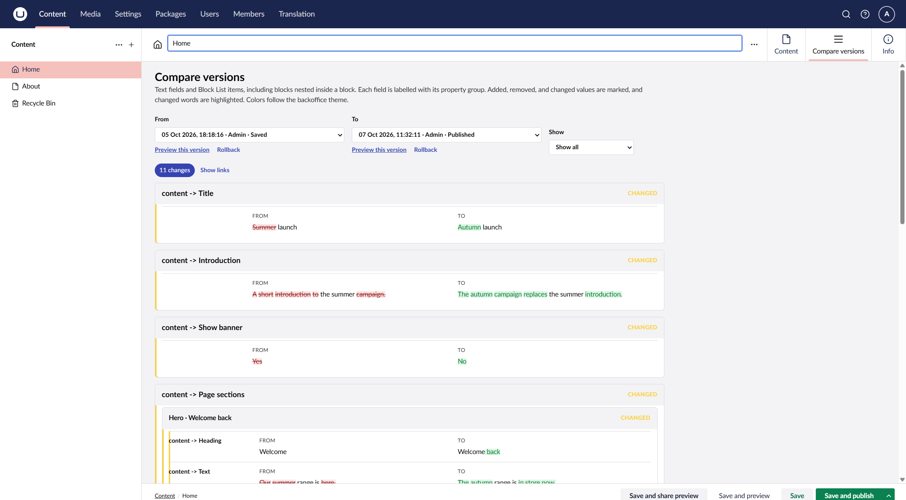
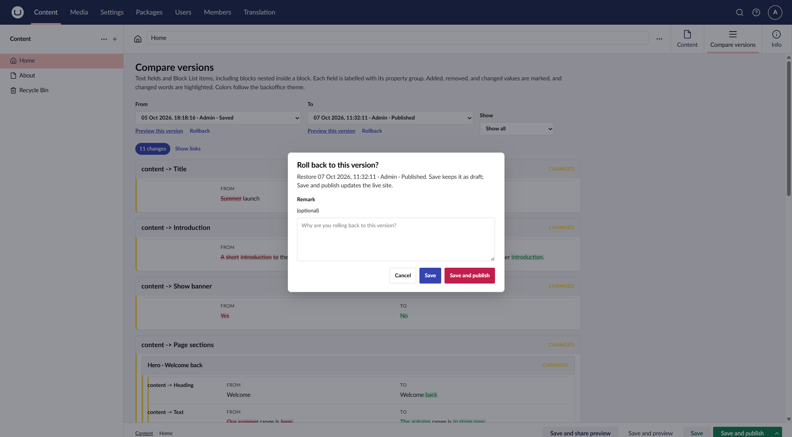
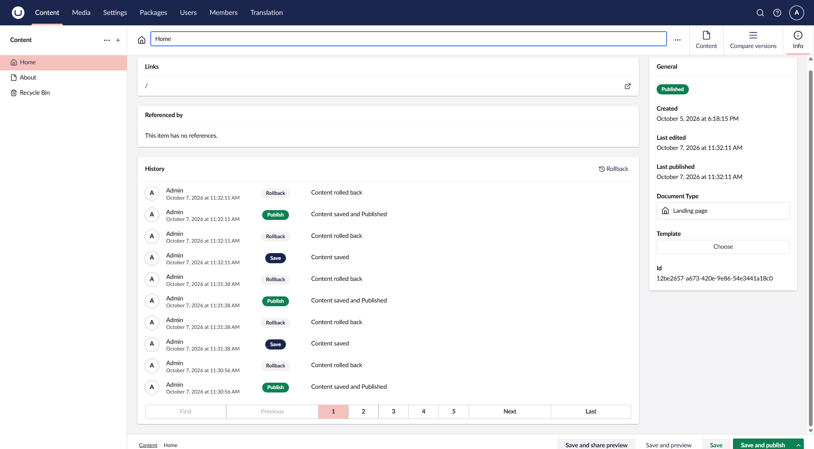
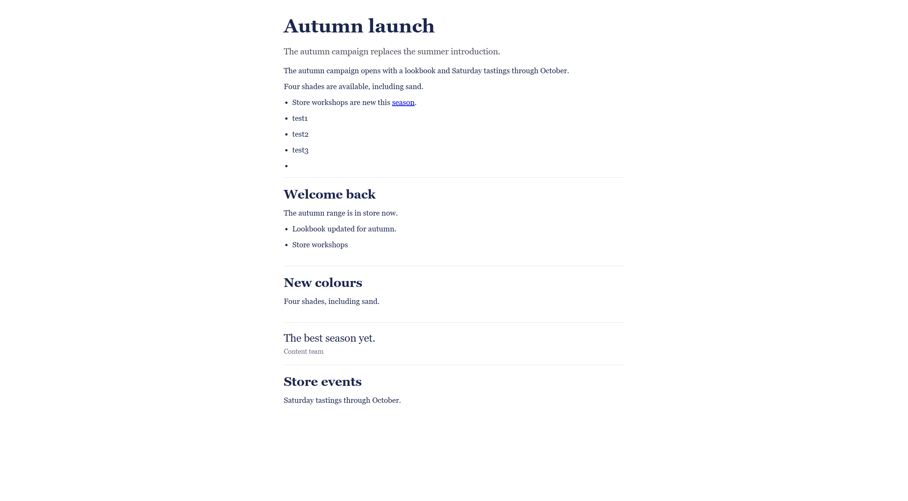

# Compare Versions & Rollback — Test Guide

| Field | Value |
| --- | --- |
| Audience | QA / UAT testers |
| Build | Block Diff demo (`BlockDiffDemo`), branch `cursor/block-diff-theme-and-filters` |
| Environment | Local Development, `https://localhost:5123` |
| Related Confluence page | *Compare Versions & Rollback — Options and Design* |

Copy this page into Confluence as the tester handoff. Tick Pass / Fail / N/A in the Result column when you run the suite.

**Screenshots:** Attach files from `docs/block-diff-rollback/screenshots/` (or the same images already on the Options page). Use them as the visual baseline for Pass/Fail.

---

## 0. Visual baseline (what you should see)

### Compare versions tab



| Check against this image | Notes |
| --- | --- |
| Tab **Compare versions** is selected (beside Content / Info) | |
| **From** / **To** / **Show** controls present | |
| **Preview this version** and **Rollback** under each select | |
| Change count badge (e.g. “11 changes”) | Number varies with content |
| Field diffs with CHANGED and red/green text | |

### Rollback dialog



| Check against this image | Notes |
| --- | --- |
| Summary names the selected version | |
| Optional **Remark** textarea | |
| Buttons: **Cancel**, **Save**, **Save and publish** | |

### History after rollback



| Action under test | Expected new rows (same timestamp) |
| --- | --- |
| Save (draft) | Save + Rollback |
| Save and publish | Save + Rollback + Publish |
| Remark | No extra History row |

*Note: The sample screenshot may still show four rows from an earlier build that wrote a custom Rollback audit for remarks. Current build should not add that fourth row — use the table above as the oracle, not the older four-row cluster.*

### Live site (publish verification)



After **Save and publish**, hard-refresh `/` and confirm the restored published wording appears (seasonal title/intro matching the version you restored). After **Save** only, `/` must **not** change.

---

## 1. Prerequisites

### 1.1 Access

| Item | Value |
| --- | --- |
| Backoffice URL | `https://localhost:5123/umbraco` |
| Frontend URL | `https://localhost:5123/` |
| Login | `admin@example.com` |
| Password | `BlockDiff-demo-1` |

Ask the developer if credentials differ on your environment.

### 1.2 Start the demo (developer or tester with .NET)

```powershell
cd <path-to>\BlockDiffDemo
$env:ASPNETCORE_ENVIRONMENT = "Development"
dotnet run --no-launch-profile --urls https://localhost:5123
```

Accept the HTTPS certificate warning if the browser prompts.

### 1.3 After a code or package update

1. Restart the site process.  
2. Hard-refresh the backoffice (Ctrl+F5) so `block-diff-view.js?v=…` reloads.  
3. If the Compare versions tab looks stale, clear site data for localhost or open a private window.

### 1.4 Recommended test content

Use the seeded **Home** page (or any page with Block List / Block Grid and a few saved versions).

Before deep tests, create a clear content trail:

1. Open Home → edit a visible text field (e.g. seasonal wording) to value **A** → **Save and publish**.  
2. Change the same field to value **B** → **Save and publish**.  
3. Change again to value **C** → **Save** only (draft, not published) if you need draft ≠ live.  

Note the dates/times shown in Compare versions for A / B / C.

---

## 2. Scope

### In scope

- Compare versions workspace tab (diff, filters, labels, preview links)  
- Rollback dialog: Cancel, Save, Save and publish, optional remark  
- Effect on draft vs live homepage  
- Version labels (user, Published / Current draft / Saved, remark)  
- History tab entry counts after rollback  

### Out of scope (unless separately agreed)

- Built-in Info → Rollback modal behaviour (except as comparison)  
- Rollback Previewer visual/JSON tabs internals  
- Performance on very large Block Grid pages  
- Multi-language / variant documents  
- Permissions for non-admin users  

---

## 3. Smoke checklist (quick)

| # | Step | Expected | Result |
| --- | --- | --- | --- |
| S1 | Log in to backoffice | Dashboard loads | |
| S2 | Open Home → **Compare versions** tab | Tab loads; From/To populated | |
| S3 | Change From/To | Diff refreshes; no console errors | |
| S4 | Open frontend `/` | Page renders with current published content | |

---

## 4. Detailed test cases

### TC-01 — Version list labels

| | |
| --- | --- |
| **Priority** | High |
| **Steps** | 1. Open Compare versions. 2. Expand From and To. |
| **Expected** | Each option shows date/time, username (or Unknown user), and one of: **Published**, **Current draft**, **Saved**. Exactly one version shows **Published** when the page is published. If draft differs from live, **Current draft** and **Published** are different versions. |
| **Result** | |
| **Notes** | |

---

### TC-02 — Diff shows field-level changes

| | |
| --- | --- |
| **Priority** | High |
| **Steps** | 1. Select From = older version, To = newer with known text/block change. 2. Set Show = **Show only differences**. |
| **Expected** | Changed fields/blocks listed with readable before/after (not a single opaque JSON blob for the whole property). Unchanged items hidden when filter is “differences”. Compare layout to Figure in §0 (`01-compare-versions.png`). |
| **Result** | |
| **Notes** | |

---

### TC-03 — Filters

| | |
| --- | --- |
| **Priority** | Medium |
| **Steps** | With a known mix of changed and unchanged fields: switch Show between **all**, **only differences**, **unchanged**. |
| **Expected** | Lists match the filter. No crash when a filter yields an empty list (empty state message is acceptable). |
| **Result** | |
| **Notes** | |

---

### TC-04 — Preview this version

| | |
| --- | --- |
| **Priority** | High |
| **Steps** | 1. Select a non-current version. 2. Click **Preview this version** under From or To. |
| **Expected** | New tab/window opens a preview of that version’s content (not necessarily the live homepage). Link is hidden or disabled when no version is selected as appropriate. |
| **Result** | |
| **Notes** | |

---

### TC-05 — Rollback dialog opens for selected dropdown

| | |
| --- | --- |
| **Priority** | High |
| **Steps** | 1. Choose version X in **From**. 2. Click **Rollback** under From. 3. Cancel. 4. Choose version Y in **To**. 5. Click **Rollback** under To. |
| **Expected** | Dialog matches `02-rollback-dialog.png` (remark + three actions). Summary refers to the version belonging to that control (X then Y). Cancel closes with no content change. |
| **Result** | |
| **Notes** | |

---

### TC-06 — Save (draft only)

| | |
| --- | --- |
| **Priority** | Critical |
| **Precondition** | Live site shows published value **B**. An older version has value **A**. |
| **Steps** | 1. Rollback to version **A**. 2. Leave remark empty. 3. Click **Save**. 4. Check Compare versions / content editor draft. 5. Open frontend `/` (hard refresh). 6. Open Info → **History**. |
| **Expected** | Draft content is **A**. Live homepage still shows **B**. History shows **two** new rows at the same time: **Save** and **Rollback** (no Publish, no second custom Rollback). Success toast mentions draft. |
| **Result** | |
| **Notes** | |

---

### TC-07 — Save and publish

| | |
| --- | --- |
| **Priority** | Critical |
| **Precondition** | Live site shows **B**. Older version has **A**. |
| **Steps** | 1. Rollback to **A**. 2. Click **Save and publish**. 3. Hard-refresh frontend `/`. 4. Check History. |
| **Expected** | Live homepage shows **A**. History shows **three** rows at the same time: **Save**, **Rollback**, **Publish**. Toast mentions published. |
| **Result** | |
| **Notes** | |

---

### TC-08 — Optional remark appears on Compare versions

| | |
| --- | --- |
| **Priority** | High |
| **Steps** | 1. Rollback to an older version with remark text e.g. `UAT: restore summer hero`. 2. Use **Save** or **Save and publish**. 3. Reload Compare versions. 4. Open From/To lists. 5. Check History. |
| **Expected** | The **new** current version’s label includes the remark text. History does **not** gain an extra Rollback row solely for the remark. Remark is optional (empty remark still succeeds). |
| **Result** | |
| **Notes** | |

---

### TC-09 — Cancel does nothing

| | |
| --- | --- |
| **Priority** | Medium |
| **Steps** | Open Rollback, type a remark, click **Cancel** (or click the dimmed backdrop). |
| **Expected** | No draft/live change; remark not stored; dialog closed. |
| **Result** | |
| **Notes** | |

---

### TC-10 — Editor refresh after rollback

| | |
| --- | --- |
| **Priority** | High |
| **Steps** | After Save or Save and publish, stay on the document workspace (Content / Compare versions). |
| **Expected** | UI reflects restored content without a full browser restart. Version list reloads; Published / Current draft badges update correctly. |
| **Result** | |
| **Notes** | |

---

### TC-11 — History noise (known limitation)

| | |
| --- | --- |
| **Priority** | Medium (documentation) |
| **Steps** | Perform TC-06 and TC-07 once each; screenshot History. Attach your shot next to baseline `03-history-entries.png`. |
| **Expected** | 2 entries for draft Save; 3 for Save and publish. **Not** 4. Document as expected Umbraco behaviour (not a defect unless counts differ). |
| **Result** | |
| **Notes** | |

---

### TC-12 — Negative: cannot rollback without a version key

| | |
| --- | --- |
| **Priority** | Low |
| **Steps** | If Rollback is shown without a resolvable version, click it. |
| **Expected** | Danger notification; no dialog proceed / no API failure that breaks the tab. |
| **Result** | |
| **Notes** | May be hard to force on the happy path; N/A if not reproducible. |

---

## 5. Regression around Compare versions (non-rollback)

| # | Check | Expected | Result |
| --- | --- | --- | --- |
| R1 | Theme / light-dark | Uses backoffice colours; readable in both if available | |
| R2 | Hide / show change links | Links can be collapsed so the diff stays visible | |
| R3 | Section jump | Jumping to a section scrolls within the compare view | |
| R4 | Nested blocks | Nested change appears under parent block structure | |

---

## 6. Defect reporting template

When logging a bug, include:

1. Environment URL and build/branch (or commit hash if known)  
2. Test case id (e.g. TC-07)  
3. Steps  
4. Expected vs actual  
5. Screenshot of Compare versions **and** frontend **and** History when relevant  
6. Whether action was **Save** or **Save and publish**  
7. Browser and hard-refresh attempted (Yes/No)  

---

## 7. Sign-off

| Role | Name | Date | Verdict (Pass / Fail / Pass with caveats) |
| --- | --- | --- | --- |
| Tester | | | |
| Developer | | | |
| Product (optional) | | | |

**Caveats / known issues:**  
_Use this space for accepted limitations (e.g. History shows 2–3 rows; remarks are POC file storage)._

---

## 8. Quick reference — expected History counts

| Action | History rows (same timestamp) |
| --- | --- |
| Rollback → **Save** | Save + Rollback |
| Rollback → **Save and publish** | Save + Rollback + Publish |
| Remark only | No extra History row; label on Compare versions only |
