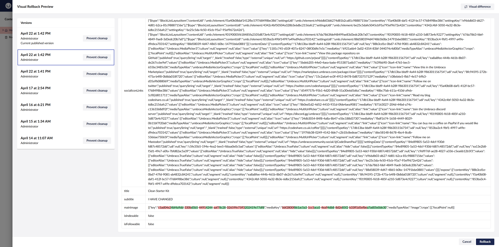
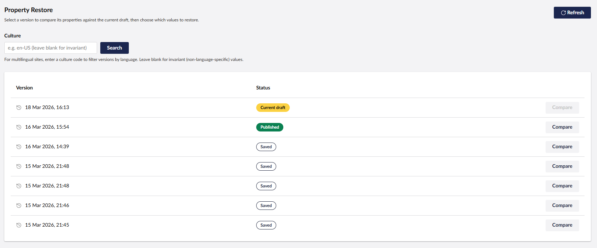
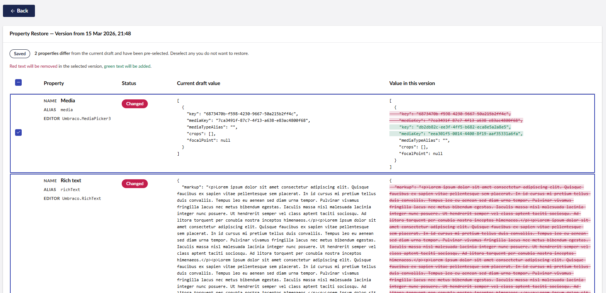

# Umbraco 17 content version history

Checked on 5 October 2026 for a self-hosted Umbraco 17 site on .NET 10.

Editors compare versions of one content item. Block List, Block Grid, and Rich Text blocks are stored as JSON, and the history screen prints that JSON. The useful outcome is a readable field diff, a visual preview of the old page, a shareable preview link, and a short summary of what changed.

**Use the free Rollback Previewer for the visual preview and the share link. Plan a small custom view for the readable block diff and the summary. Do not buy Umbraco Deploy or uSync.Complete for this screen.**

## What the built-in history shows

On a content item, **Info → Rollback** lists saved versions (date, user, current draft, current published, prevent cleanup). Choosing a version shows each property alias and the stored value.

Simple values such as text are readable. Block List, Block Grid, and Rich Text blocks are one JSON value. A Block List value is a `BlockListLayout` object: content keys, element type keys, and the raw property values inside each block. Nested blocks are more JSON inside that value. From Umbraco 17.2.0 the diff highlight is off until an editor turns it on, because highlighting a large block document can hang the browser ([issue 18518](https://github.com/umbraco/Umbraco-CMS/issues/18518), fixed in [pull request 21426](https://github.com/umbraco/Umbraco-CMS/pull/21426)).

The CMS licence is free (MIT). There is no add-on that turns this view into labelled block fields.

## Comparison

| Option | Licence | Readable block fields | Visual page preview | Share link | Change summary | Fits Umbraco 17 / .NET 10 |
| --- | --- | --- | --- | --- | --- | --- |
| Built-in Rollback | £0 | No. Blocks are JSON | No | No | No | Yes, included |
| [Rollback Previewer 17.0.3](https://www.nuget.org/packages/Umbraco.Community.RollbackPreviewer/17.0.3) | £0, MIT | No. The JSON tab is still the raw value | Yes. Side-by-side render of the page | Yes. Secret and expiry in config | No | Yes. `net10.0`, Umbraco `[17, 18)` |
| [uRestore 1.0.7](https://www.nuget.org/packages/Umbraco.Community.uRestore/1.0.7) | £0, MIT | No. Complex values are serialised to JSON. A block property restores as a whole | No | No | Partial. It names the property, not the field inside a block | Yes. `net10.0`, Umbraco 17+ |
| Custom block diff | £0 licence. Build time below | Yes, if we walk the block model | Keep Rollback Previewer | Keep Rollback Previewer | Yes | Yes |
| [uSync.Complete](https://www.jumoo.co.uk/usync/buy/) | £1,150 excl. VAT once, or £550 excl. VAT per year | No | Compares another server, not an older version of this item | No | Environment diff | Yes, v17. New licences from 1 September 2025 cover Umbraco 8–20 |
| [Umbraco Deploy On-premises](https://umbraco.com/products/add-ons/deploy/umbraco-deploy-on-premises/) | €2,800 subscription from 1 January 2026 | No | Moves content between environments | No | No | Self-hosted add-on. Confirm the billing interval with Umbraco |

Prices are the public figures on 5 October 2026 and can change.

## Rollback Previewer

NuGet: `Umbraco.Community.RollbackPreviewer` version **17.0.3** (8 May 2026). Authors Richard Ockerby and Mike Masey. MIT. It replaces the Rollback modal.

```bash
dotnet add package Umbraco.Community.RollbackPreviewer --version 17.0.3
```

The package dependency is `Umbraco.Cms` `[17, 18)` and the project targets `net10.0`. Release 17.0.3 notes support work for Umbraco 17.3. Install it on a copy of the site and confirm the exact 17.x patch before using it on a shared environment.

What it adds:

- A **visual** tab that renders the current version and the selected version side by side, using the site templates. Block List, Block Grid, and Rich Text appear as the page, when a template renders them.
- A **JSON** tab. Simple properties are highlighted as text. Block properties stay as one JSON line. This is the same raw data editors see today.
- A public preview URL. `EnableFrontendPreviewAuthorisation`, `FrontendPreviewAuthorisationSecret`, `EnableTimeLimitedSecrets`, and `SecretExpirationMinutes` live under `RollbackPreviewer` in `appsettings.json`.

The preview is an iframe. If `X-Frame-Options` or `Content-Security-Policy` `frame-ancestors` blocks it, the visual tab stays blank until those headers allow the backoffice origin.

The vendor screenshot of a "Save and Share Preview" button is the Umbraco 13 editor. Version 17 puts sharing on the rollback modal, so that older screenshot is not included here.


*Visual tab. Source: [Rockerby/Umbraco.Community.RollbackPreviewer](https://github.com/Rockerby/Umbraco.Community.RollbackPreviewer/blob/17.0.3/docs/screenshots/visual_diff.png), version 17.0.3.*



*JSON tab. The top property is `BlockListLayout` JSON. Title and subtitle underneath are normal text. Source: [json_diff.png](https://github.com/Rockerby/Umbraco.Community.RollbackPreviewer/blob/17.0.3/docs/screenshots/json_diff.png).*

Limits to test on a real page:

- A change inside a nested block is visible only when that text appears on the rendered page.
- The JSON tab still highlights large block JSON. The 17.2 built-in toggle does not apply after this package replaces the modal. Try the largest Block Grid page in the trial.
- The package is community-maintained (about 1,500 downloads of 17.0.3 on NuGet when checked). There is no paid support contract.

## uRestore

NuGet: `Umbraco.Community.uRestore` version **1.0.7** (18 March 2026). MIT. Umbraco 17+ and .NET 10. It adds a **Property Restore** workspace view. It leaves the Info → Rollback screen in place.

It lists versions with a culture filter, then diffs each property against the current draft. Changed properties are pre-selected. Restore writes a new draft, or save-and-publish, for the selected properties only.

Non-string values are passed through `JsonSerializer.Serialize`. Block List, Block Grid, Rich Text, and media pickers therefore still show JSON. The package states that it restores a Block List or Block Grid as the whole property, not as a single block.

About 150 downloads of 1.0.7 when checked, and the repository had one star. Treat it as an early package. It is useful when editors must restore one simple property (a title, a date) and leave the blocks alone. It does not make nested content readable.



*Version list. Source: [Jordan-Smith-Dev/uRestore](https://github.com/Jordan-Smith-Dev/uRestore/blob/main/docs/uRestore_preview-001.png).*



*Property diff. Media Picker keys and Rich Text `markup` are raw. Source: [uRestore_preview-002.png](https://github.com/Jordan-Smith-Dev/uRestore/blob/main/docs/uRestore_preview-002.png).*

## Custom block diff

This is the option that can show nested content as fields. Rollback Previewer already covers the rendered page and the share link, so the custom work is the readable diff and the summary.

Read both versions with `IContentVersionService` (the same service uRestore uses). For each property, branch on `PropertyEditorAlias`:

| Editor alias | Stored shape to walk |
| --- | --- |
| `Umbraco.BlockList` | Layout items, then each element's `contentData` / settings. Recurse when an element property is itself a block editor or Rich Text. |
| `Umbraco.BlockGrid` | Layout areas, then the same element values. Include area name from the data type config. |
| `Umbraco.RichText` | `markup` as text, plus the blocks collection on the value. |
| Text, textarea, number, true/false, dropdown | Compare the scalar. |
| Media picker, content picker, multi URL picker | Resolve the key or UDI to a name before display. |

Look up the element type and print the property **name** from the document type, not the alias. A summary line can be derived from that walk: which blocks were added or removed, and which labels changed.

Put the view on the document workspace, next to Info. Leave the Rollback modal to Rollback Previewer so the two packages do not both replace it.

Effort, after a working trial of Rollback Previewer. These are development ranges, not a quote:

| Slice | Range |
| --- | --- |
| Block List, one level, plus scalar properties and a summary | 5–8 days |
| Block Grid areas, nested blocks, Rich Text blocks, picker names | 5–8 days |
| **Total for the readable diff and summary** | **10–16 days** |

Add another 3–5 days only if the readable diff must sit inside the rollback modal beside the visual preview. That means a fork of Rollback Previewer.

## Paid products checked

These are real Umbraco products with public prices. They move or compare content **between environments**. They do not change the version history of one item.

### uSync.Complete (Jumoo)

- Project licence: **£1,150 excl. VAT**, one-off, all sites in one project pipeline (local, dev, staging, live). [Checkout](https://jumoo.co.uk/new-checkout/?p=usync-domain).
- Project subscription: **£550 excl. VAT per year**. [Checkout](https://checkout.jumoo.co.uk/?p=usync-sub-domain).
- A new licence from 1 September 2025 includes Umbraco 8 through 20, including 17. Older licences may need an upgrade. [Jumoo buy page](https://www.jumoo.co.uk/usync/buy/).
- 60-day trial, full features.
- Includes Publisher, Exporter, Snapshots, and People Edition. Snapshots compare a point in time across sites. Quick Compare in v17 compares this server with another server.

The free `uSync` package writes schema to disk. It is not a history viewer.

### Umbraco Deploy On-premises

- Public price **€2,800**. From 1 January 2026 the old one-time fee was removed and new customers buy it as a subscription at that figure ([price announcement](https://umbraco.com/blog/annual-price-changes-2026/), [product page](https://umbraco.com/products/add-ons/deploy/umbraco-deploy-on-premises/)).
- The pages checked do not state the billing interval in plain text. Confirm that with Umbraco before budgeting.
- It transfers schema, content, and media between self-hosted environments. It is the same engine as Umbraco Cloud. It does not render an old version of a Block Grid as fields.

Umbraco Workflow (also listed at €2,800 in the 2026 price announcement) is an approval flow. It is outside this requirement.

## Suggested proof

1. On a copy of the site, install `Umbraco.Community.RollbackPreviewer` 17.0.3.
2. Open a page that uses Block List, Block Grid, and a Rich Text block. Compare two versions.
3. Confirm the visual tab shows the nested content, the iframe is allowed, and the JSON tab is still unusable for those properties.
4. Create a share link and open it outside the backoffice. Check the secret and the expiry.
5. Repeat on the largest block document and watch the browser when the JSON tab is opened.
6. If editors can work from the rendered page, stop there. If they need the field name inside a block, schedule the custom view. Skip uRestore unless single-property restore is also required.

## Sources

- Rollback modal model: [UmbContentRollbackVersionDetailModel](https://apidocs.umbraco.com/v17/ui-api/interfaces/packages_content_content.UmbContentRollbackVersionDetailModel.html) (`alias`, `culture`, `value`).
- Built-in diff performance: [issue 18518](https://github.com/umbraco/Umbraco-CMS/issues/18518), [pull request 21426](https://github.com/umbraco/Umbraco-CMS/pull/21426) (shipped in 17.2.0).
- Rollback Previewer: [GitHub](https://github.com/Rockerby/Umbraco.Community.RollbackPreviewer), [NuGet 17.0.3](https://www.nuget.org/packages/Umbraco.Community.RollbackPreviewer/17.0.3), [release 17.0.3](https://github.com/Rockerby/Umbraco.Community.RollbackPreviewer/releases/tag/17.0.3).
- uRestore: [GitHub](https://github.com/Jordan-Smith-Dev/uRestore), [NuGet 1.0.7](https://www.nuget.org/packages/Umbraco.Community.uRestore/1.0.7). `PropertyRestoreService` serialises non-string values with `JsonSerializer.Serialize`.
- uSync.Complete pricing: [buy page](https://www.jumoo.co.uk/usync/buy/), [domain checkout](https://jumoo.co.uk/new-checkout/?p=usync-domain), [subscription checkout](https://checkout.jumoo.co.uk/?p=usync-sub-domain).
- Deploy pricing: [2026 price announcement](https://umbraco.com/blog/annual-price-changes-2026/), [Deploy On-premises](https://umbraco.com/products/add-ons/deploy/umbraco-deploy-on-premises/).

Screenshots in this folder are copies of the package authors' images, kept so the note can be read offline. The caption under each image links to the original.
